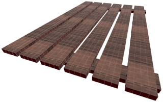
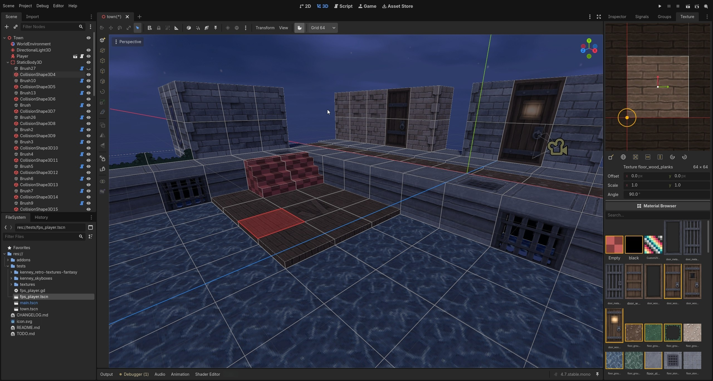

  

<h1 align="center">Duckboard <em>for Godot 4.7+</em></h1>

  
  
  

> [!NOTE]
> Duckboard is in early development (0.x). It is already a capable brush editor, but the
> API and file layout may still change before 1.0. Back up your scenes.

**Duckboard is a Godot editor plugin that brings TrenchBroom-style brush editing straight
into the 3D viewport** - grid-snapped convex brushes with vertex, edge, and face editing,
clip and CSG tools, world-projected per-face textures, and a two-way `.map` clipboard so
you can paste geometry to and from TrenchBroom itself. If you know TrenchBroom, your hands
already know Duckboard: the tools, shortcuts, and grid model are deliberately the same.

  

## Why Duckboard

Blocking out levels for a Godot game usually means one of two things: fighting CSG nodes
and gizmos that were never built for level design, or working in an external editor
(TrenchBroom, Hammer) and living with an export/import round-trip every time you want to
see the level with your actual lighting, materials, and gameplay.

Duckboard removes the round-trip. Brushes are real `MeshInstance3D` nodes in your scene
tree - they render with your materials and lights, they save in your `.tscn`, they undo
with `Ctrl+Z`, and you can attach gameplay to them by extending the `Brush` class. The
editor is the game engine.

## Features

### Brush editing

<!-- TODO gif: draw a cuboid + stairs, drag a vertex and a face
	 (docs/media/feature_brushes.gif, 800x450, under 10 MB) -->

- **Convex brushes, TrenchBroom-style** - drag out cuboids, stairs, cylinders, and cones
  with a live ghost preview. Drawing needs no tool: with nothing selected, a drag just draws.
- **Vertex, edge, and face tools** - reshaping a shared corner or edge moves it on
  *every* selected brush, so seams between abutting brushes never tear open.
- **Face gestures** - `Shift+drag` pushes a face's plane along its normal;
  `Ctrl+Shift+drag` extrudes a new brush outward or splits the brush inward.
- **Clip tool** - place points, cycle keep-front/keep-back/keep-both with `Ctrl+Enter`,
  apply with `Enter`.
- **Scale, shear, rotate** - `Alt` anchors scale to the centre, `Shift` scales
  proportionally, `Alt` shears vertically; numeric toolbars for exact sizes, factors,
  and angles.
- **CSG** - Convex Merge, Subtract, Intersect, Hollow, and a two-face bridge.
- **Brush groups** - several brushes that read as one unit *and* collapse to a single
  merged mesh at rest, so the map is always already baked, group by group. Faces buried
  between touching members are dropped from that mesh, and Godot's own trimesh collision
  and lightmap UV2 unwrap then apply to a whole room at once. Double-click a group to edit
  its members individually, with the rest of the map washed back for context.
- **Multi-brush everything** - every tool acts on the whole selection.

### Textures & UVs

<!-- TODO gif: drag a texture onto a face, then adjust it in the UV canvas
	 (docs/media/feature_textures.gif, 800x450, under 10 MB) -->

- **World-projected per-face textures** using TrenchBroom's Valve-220 parallel UV
  system, with texture lock and UV lock so geometry edits don't smear your alignment.
  Textures arrive at their own size - a 64x128 image covers 64x128 map units, TrenchBroom's
  scale 1 - and **Fit** solves scale and offset so a face holds whole repeats with nothing
  cut off at the edges.
- **Transparent pixels are cut out**, not blended, so brushes stay in the opaque pass and keep
  their shadows and sorting. Faces left untextured are dropped from the mesh in the running
  game, which gives you nodraw with no bake step.
- **Texture dock** - a searchable thumbnail browser of your project's textures *and*
  materials; click to assign to the selection.
- **Drag & drop** - drop a texture or material from the FileSystem dock onto a face, or
  hold `Shift` for the whole brush.
- **UV canvas** - drag, rotate, and scale a face's UVs visually, on its actual material.
- **Face selection** - `Shift+click` selects a face, `Ctrl+Shift+click` adds more; the
  dock edits any mix of faces and brushes as one set.

### TrenchBroom interop

<!-- TODO gif: copy brushes in TrenchBroom, Ctrl+V into Godot, edit, copy back
	 (docs/media/feature_map_clipboard.gif, 800x450, under 10 MB) -->

- **Two-way `.map` clipboard** - `Ctrl+C` copies the selection as Valve-220 `.map` text;
  `Ctrl+V` pastes TrenchBroom's clipboard as real brushes, framed in front of the camera.
  Unit scale (32 TB units = 1 m), Z-up↔Y-up, and UV axes are converted for you.
- **The same muscle memory** - TrenchBroom's tool shortcuts, selection modifiers, and grid
  behaviour (only the element you edit snaps; untouched geometry keeps its exact
  coordinates).

### A native Godot citizen

- **Per-scene toggle** - a duck button in the 3D toolbar turns map-editing mode on per
  scene, remembered across sessions. Off means *off*: every shortcut and gizmo returns to
  stock Godot.
- **One undo step per gesture** - every draw, drag, clip, paste, and texture assignment is
  a single, cleanly named entry in Godot's undo history.
- **Extensible brushes** - attach behaviour with `extends Brush` (call `super()` in
  `_ready`); all tools recognise subclasses.
- **Responsive tool palette** - Blender-style: drag it wider for two columns or full
  labels.

## Installation

Duckboard is not on the Asset Library yet. Until then:

1. Copy `addons/duckboard` into your project's `addons/` folder.
2. Enable **Duckboard** in *Project → Project Settings → Plugins*.
3. Open a 3D scene and press the duck button in the 3D viewport toolbar.

Requires **Godot 4.7 or newer** - the version Duckboard is developed and tested on.

> This repository is the full development project (test scenes, textures). The addon
> itself is entirely contained in [`addons/duckboard`](addons/duckboard).

## Shortcuts

Active only while map-editing mode is on - with the duck off, Godot's own bindings return.

| Tool | Key | | Action | Key |
|---|---|---|---|---|
| Brush (hull) | `B` | | Duplicate | `Ctrl+D` (or `Ctrl+drag`) |
| Clip | `C` | | Flip horizontally | `Ctrl+F` |
| Vertex | `V` | | Flip vertically | `Ctrl+Alt+F` |
| Edge | `E` | | Copy / paste `.map` | `Ctrl+C` / `Ctrl+V` |
| Face | `F` | | Delete selection | `Delete` |
| Rotate | `R` | | Grid size up / down | `+` / `-` |
| Scale | `T` | | Commit hull / apply clip | `Enter` |
| Shear | `G` | | Cancel / deselect / leave tool | `Escape` |
| UV lock | `U` | | | |

**Drawing** - the Simple Shape tool has no button and no shortcut, matching TrenchBroom: with
nothing selected and no tool active, just drag in the viewport. `B` is the Brush tool, which
builds a brush from the convex hull of points placed on existing faces.
**Selection** - click selects a brush, `Ctrl+click` toggles it in the selection,
`Shift+click` selects a face, `Ctrl+Shift+click` adds a face. **Face gestures** -
`Shift+drag` pushes a face's plane; `Ctrl+Shift+drag` extrudes outward or splits inward.
**Groups** - double-click a group to open it, `Escape` or a click outside to close.

## Deliberate divergences from TrenchBroom

Duckboard follows TrenchBroom where it can and diverges only on purpose - each of these is
a considered decision, not a gap:

- **Rotation transforms the geometry, not the node** - planes are rotated in place, so
  textures and UVs survive untouched and node transforms stay identity.
- **Materials, not just textures** - a face can wear a full Godot `Material`, shown as a
  sphere in the browser. That's a Godot-native superpower the `.map` format can't express.

## Roadmap

- **Settings panel** for grid, colours, and keybindings.
- **Godot grid sync** - drive the orthographic view grids from the plugin's grid size.

## Credits

- **[TrenchBroom](https://github.com/TrenchBroom/TrenchBroom)** by Kristian Duske and
  contributors - the design north star for the whole plugin.
- The example scene is dressed with **[Retro Textures Fantasy](https://kenney.nl/assets/retro-textures-fantasy)**
  and **[Skyboxes](https://kenney.nl/assets/skyboxes)** by **[Kenney](https://kenney.nl)** -
  released under CC0, and a genuine pleasure to build a demo level with. The test map is
  modelled on the sample render that ships with Retro Textures Fantasy, rebuilt as brushes
  in Duckboard. Thank you, Kenney. These assets live in `tests/` and are part of the
  development project only; the addon itself ships no third-party assets.
- Made by Diogo Gomes as tooling for his future game, *Rune Thief*.

Duckboard is released under the [MIT license](LICENSE.md).
